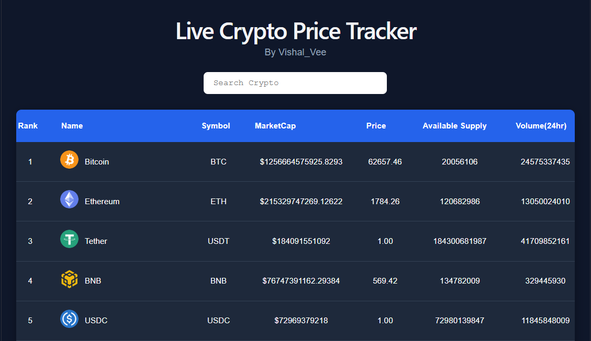

# Crypto Price Tracker

A modern React application that displays live cryptocurrency prices using the CoinStats API. The project demonstrates API integration with Axios, React Hooks, and dynamic search functionality.

## Preview

> 

---

## Features

- Live cryptocurrency data
- Search cryptocurrencies by name
- Axios for API requests
- React Hooks (`useState`, `useEffect`)
- Responsive UI
- Fast performance with Vite

---

## Tech Stack

- React
- Vite
- JavaScript (ES6+)
- Axios
- CSS3
- CoinStats API

---


## Installation

Clone the repository

```bash
git clone https://github.com/your-username/CryptoPriceTracker.git
```

Move into the project

```bash
cd CryptoPriceTracker
```

Install dependencies

```bash
npm install
```

Create a `.env` file

```env
VITE_X_API_KEY=YOUR_API_KEY
```

Start the development server

```bash
npm run dev
```

---
## API Setup

Create a `.env` file in the root folder and add:

```env
VITE_API_KEY=your_api_key_here
```
---

## What I Learned

- Working with REST APIs
- Fetching data using Axios
- Managing state with React Hooks
- Handling asynchronous requests
- Environment variables in Vite
- Building reusable React components

---
## Author
Vishal_Vee